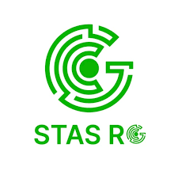

  

<h1 align="center">STAS-RG</h1>
<h3 align="center">Smart Technology and Applied Sciences Research Group</h3>

  Center of Excellence • Research • Innovation • Applied Sciences

---

##  About Us
**STAS-RG (Smart Technology and Applied Sciences Research Group)** is a Center of Excellence
focused on smart technology, applied sciences, and innovative system development.
We aim to generate impactful research, prototypes, and real-world solutions
through collaboration between academia and industry.

---

##  Research Focus
-  Smart Systems & Connectivity  
-  Automation & Intelligent Systems  
-  Network & Information Security  
-  IoT & Embedded Systems  
-  Cloud & Applied Computing  
-  Applied Research & Prototyping  

---

##  Web Technologies & Frameworks

###  Frontend

---

###  Backend

---

###  Full-Stack & Meta Frameworks

---

###  Database & API

---

###  DevOps & Cloud

---

## Featured Projects
- Smart Web-Based Monitoring Systems  
- Secure Information Systems  
- Research Management Platforms  
- IoT & Cloud-Integrated Applications  

---

## Official Website
🔗 https://www.stas-rg.com/

---

## 📫 Collaboration
Email: contact@stas-rg.com  
Open for research collaboration, student projects, and industry partnerships

  <i>“Research • Innovation • Impact”</i>

